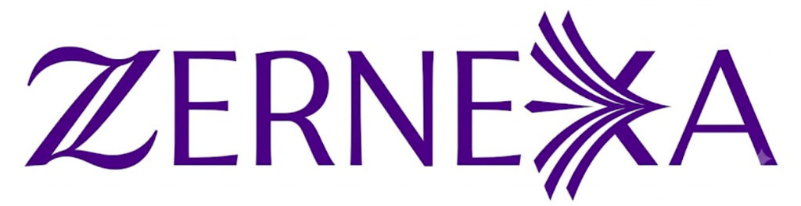
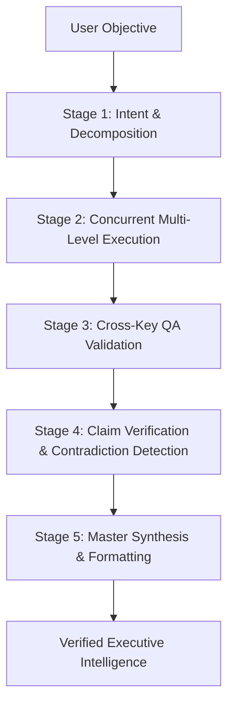

 

# ZERNEXA

### The Autonomous Multi-Key Intelligence Mesh & Screen-Native AI Companion

A local-first neural orchestration platform uniting multi-provider load balancing, an empirical 5-stage synthesis pipeline, and a living desktop companion with system-level automation.

 

# **Status: Private Beta &nbsp;·&nbsp; Coming Soon**

[Overview](#overview) &nbsp;·&nbsp; [The 5-Stage Engine](#the-5-stage-synthesis-engine) &nbsp;·&nbsp; [Desktop Companion](#desktop-companion-zuru) &nbsp;·&nbsp; [Multi-Key Mesh](#multi-key-neural-mesh) &nbsp;·&nbsp; [Privacy & Security](#privacy-and-security)

---

## Overview

Modern AI applications suffer from three critical bottlenecks: single-provider rate limits, unverified model hallucinations, and rigid web-browser chat interfaces.

**ZERNEXA** completely reimagines personal AI infrastructure. Built as an ultra-fast local desktop application, ZERNEXA orchestrates a dynamic multi-key neural pool across Google Gemini, Groq, Cerebras, OpenRouter, and NVIDIA. It dynamically decomposes complex user objectives into parallel execution graphs, cross-checks every assertion across disjoint model families, and delivers synthesized intelligence directly to your desktop—accompanied by an expressive, screen-native AI pet companion capable of interacting with your operating system.

  

  
<em>ZERNEXA Desktop Interface: Real-time Live Engine Trace displaying 40-stage neural hierarchy and multi-key load balancing.</em>

---

## Key Highlights

| Architecture | Capability |
| :--- | :--- |
| **Multi-Key Neural Mesh** | Pool 60+ API keys with intelligent LRU rotation, automatic cooldown recovery, and zero-downtime failover. |
| **5-Stage Synthesis Engine** | Query decomposition, concurrent multi-level dispatch, cross-key validation, contradiction detection, and master synthesis. |
| **Dual-Track Routing** | Instant single-call execution for casual queries (**Synth OFF**) vs. deep multi-agent hierarchical reasoning (**Synth ON**). |
| **Screen-Native Companion** | **Zuru**—a charming, state-driven desktop AI companion living directly on your screen with real OS automation capabilities. |
| **Local-First & Zero Telemetry** | 100% private. Session memory, keys, and chat history remain on your machine with military-grade Fernet encryption at rest. |

---

## The 5-Stage Synthesis Engine

When **Synth Mode** is engaged, ZERNEXA does not simply query a single model. It activates an empirical multi-stage reasoning pipeline designed to eliminate hallucinations:

1. **Stage 1: Intent & Task Decomposition**  
   Analyzes task complexity and splits multifaceted research or technical prompts into isolated, dependency-mapped sub-tasks.
2. **Stage 2: Concurrent Multi-Level Execution**  
   Dispatches sub-tasks across specialized model families in parallel worker threads, with dual-dispatch redundancy for high-criticality objectives.
3. **Stage 3: Independent Cross-Key Validation**  
   Every generated output is subjected to an independent QA check evaluated by a disjoint provider key to ensure prompt adherence.
4. **Stage 4: Claim Verification & Contradiction Detection**  
   Extracts factual assertions and actively searches for contradictions across parallel provider outputs before merging.
5. **Stage 5: Master Synthesis & Executive Formatting**  
   Assembles the validated evidence into a structured, executive-grade final answer formatted with clean typography, code blocks, and data callouts.

---

## Desktop Companion: Zuru

ZERNEXA is paired with **Zuru**, an interactive screen-native AI companion engineered to bring warmth, personality, and hands-free desktop productivity to your workflow.

| Idle Blink | Thinking | Speaking | Greeting Wave |
| :---: | :---: | :---: | :---: |
|  |  |  |  |
| *Ambient Presence* | *Real-Time Reasoning* | *Voice & Audio Synthesis* | *Interactive Physics* |

### What Makes Zuru Distinctive

* **Fluid Sprite Physics & Emotion States:** Zuru reacts visually in real-time to your desktop actions—blinking, thinking through complex queries, talking with lip-synced voice feedback, and waving on launch.
* **Real System-Level OS Automation:** Zuru isn't just an animation; she can launch applications (Notepad, Calculator, Chrome, VS Code), snap windows, clear desktops, take instant screenshots, and control clipboard contents.
* **Instant Dictation & Smart Snippets:** Speak naturally or trigger typing macros—Zuru can draft code boilerplates, personal snippets, and system notes directly into whatever document you have focused.
* **Multimodal Ambient Awareness:** Equipped with computer vision integration to inspect screen content, read documents, and provide visual assistance on demand.
* **Genuine, Grounded Persona:** Crafted with natural, warm conversational intelligence that feels like a trusted peer and witty engineer—avoiding robotic disclaimers and boilerplate pleasantries.

---

## Multi-Key Neural Mesh

ZERNEXA is engineered for power users and teams who demand uninterrupted uptime. The internal `KeyPool` engine transforms standard consumer API keys into an enterprise-grade high-availability mesh.

* **Supported Inference Providers:**
  * **Google Gemini:** Gemini 2.5 / 1.5 Flash for large-context multimodal synthesis.
  * **Groq:** Ultra-low latency Llama & Qwen models running at 500+ tokens/sec.
  * **Cerebras:** Ultra-fast wafer-scale compute for instantaneous classification.
  * **OpenRouter:** Universal access to frontier model fallbacks and arbitration.
  * **NVIDIA NIM:** Enterprise-grade accelerated inference pipelines.
* **Least-Recently-Used (LRU) Balancing:** Distributes queries across your key pool to prevent hitting per-minute rate limits.
* **Smart Cooldown & Dead-Key Quarantine:** Temporarily benches rate-limited keys and auto-restores them as quotas reset, without interrupting ongoing generation.

---

## Privacy and Security

* **100% Local-First:** ZERNEXA runs on your hardware. Prompts, documents, conversation summaries, and user profiles are stored in an encrypted local SQLite database.
* **Zero Telemetry:** No user analytics, no background tracking pings, and no intermediate third-party servers.
* **Encrypted Keystore:** All API keys are protected at rest using symmetric Fernet encryption, with local keys securely generated on your machine.
* **Direct HTTPS Communication:** API requests travel exclusively between your machine and your chosen LLM providers over encrypted TLS channels.

---

## Release Timeline

ZERNEXA is currently in active private beta testing across Windows and desktop workstations.

* [x] Multi-Key Neural Orchestration Engine (60+ Key Mesh)
* [x] 5-Stage Synthesis & Claim Verification Pipeline
* [x] Flutter Desktop UI with Real-time Trace Drawer
* [x] Screen-Native Companion (Zuru) with System Automation
* [ ] Public Desktop Installer & Self-Contained Runtime Packaging
* [ ] Multi-platform Linux & macOS Desktop Builds
* [ ] Voice & Live Vision Full-Duplex Integration

---

**ZERNEXA** &nbsp;·&nbsp; *Crafted with precision for frontier AI workflows.*

Copyright © 2026 ZERNEXA Intelligence. All rights reserved.

